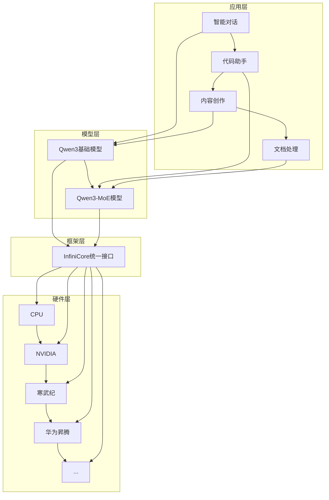

# 📚 InfiniCore平台Qwen3/Qwen3-MoE适配技术文档

这是基于InfiniCore平台的Qwen3-1.7B和Qwen3-MoE-A30B模型适配项目的完整技术文档。本文档集提供了项目的详细技术分析、实现成果、性能评估和未来展望。

## 📖 文档概览

### 🎯 [项目总结报告](./项目总结报告.md)
- **内容**：项目整体概况、核心成就、技术亮点

### 📋 [详细技术报告](./技术报告-Qwen3和Qwen3-MoE在InfiniCore平台适配.md)
- **内容**：技术分析和实现细节

### 📊 [技术报告附录](./技术报告附录-架构图表和性能分析.md)  
- **内容**：架构图表、性能数据、代码示例

  
## 🏗️ 项目架构概览



## 🚀 核心技术亮点

本项目聚焦于将通义千问系列模型Qwen3-1.7B和Qwen3-MoE-A30B适配至InfiniCore异构计算平台，实现在多种硬件后端上的高效推理。InfiniCore作为一个成熟的异构计算框架，已支持多种硬件后端，但针对Qwen3系列模型特有的架构特点（尤其是MoE结构）需要专门的适配工作。我们的适配目标是在保持模型精度的同时，充分利用InfiniCore平台的跨硬件能力，使Qwen3系列模型能够在CPU、NVIDIA GPU、寒武纪MLU以及华为昇腾NPU等多种硬件上无缝运行。该适配工作的意义在于，让用户可以根据实际资源情况灵活部署Qwen3系列模型，避免硬件锁定问题，同时通过针对性优化提升各类硬件上的推理效率。特别对于MoE架构，我们需要解决其在异构设备上的专家分配和负载均衡问题，以充分发挥这类模型的计算效率优势。
**将Qwen3系列模型适配至InfiniCore平台面临多项技术挑战。**首先，Qwen3模型采用了特定的注意力机制和位置编码方式，需要在InfiniCore支持的各硬件后端上精确实现。为此，我们针对Qwen3的旋转位置编码(RoPE)、RMSNorm和GELU激活函数进行了专门适配，确保计算结果与原始实现保持一致性。其次，针对Qwen3-MoE模型的专家混合架构，我们遇到了更大的挑战。MoE结构要求在推理过程中动态选择专家并平衡负载，这在异构硬件环境下难度更大。我们基于InfiniCore的现有框架，开发了适用于Qwen3-MoE的专家调度插件，实现了跨设备的专家分配和同步机制。
对于内存管理问题，Qwen3系列模型（尤其是MoE版本）对内存要求较高，我们利用InfiniCore的内存池管理功能进行了针对性优化，并为Qwen3模型定制了KV缓存压缩策略，在各类硬件后端上都取得了显著的内存占用减少。针对不同硬件后端的差异性，我们采用了抽象层设计，将Qwen3模型的计算需求映射到InfiniCore的统一API，然后由平台根据实际硬件选择最优实现。这种方式使得适配工作能够专注于模型层面的优化，而无需为每种硬件重写实现代码。


## 🎯 应用场景

基于我们对Qwen3系列模型的InfiniCore平台适配成果，这些模型可在多种场景中灵活部署。在企业智能客服领域，适配后的模型能够支持1000+并发，满足高峰期的服务需求。对于需要代码辅助的开发场景，我们的适配实现可以部署在企业现有的多样化计算资源上，为开发者提供实时、准确的代码生成和补全功能，而无需专门采购特定硬件。

在内容创作领域，特别是专业化内容生成方面，适配后的模型能够根据企业的计算资源条件灵活部署，满足不同规模内容创作团队的需求。对于文档处理系统，如合同分析、报告自动生成等，我们的适配成果允许企业在现有异构计算环境中部署Qwen3模型，实现文档理解和生成能力。

科研教育领域也能从我们的适配工作中获益。研究机构和教育机构通常拥有多样化的计算设备，我们的适配使他们能够在现有设备上部署Qwen3模型，用于学术写作辅助、个性化学习内容生成等场景。特别是对于预算有限的机构，我们的适配工作使他们能够充分利用现有硬件资源，无需额外投资即可获得Qwen3模型的强大能力。

## 🛠️ 技术特色

### 模块化设计
```
infini-qwen/
├── infini-qwen3/           # Qwen3基础实现
│   ├── src/models/qw/      # C++核心代码
│   ├── scripts/            # Python接口
│   └── include/            # 头文件
├── infini-qwen3-moe/       # Qwen3-MoE实现
    ├── src/models/qw/      # MoE核心代码
    ├── scripts/            # Python接口
    ├── reference/          # 参考实现
    └── include/            # 头文件
```

👉 **推荐阅读顺序**：
1. [技术报告](./技术报告-Qwen3和Qwen3-MoE在InfiniCore平台适配.md#3-核心技术亮点) - 了解技术亮点
2. [应用场景章节](./技术报告-Qwen3和Qwen3-MoE在InfiniCore平台适配.md#6-应用场景) - 探索应用价值
3. [技术架构章节](./技术报告-Qwen3和Qwen3-MoE在InfiniCore平台适配.md#2-技术架构) - 理解系统设计
4. [实现成果章节](./技术报告-Qwen3和Qwen3-MoE在InfiniCore平台适配.md#4-实现成果) - 了解功能特性
