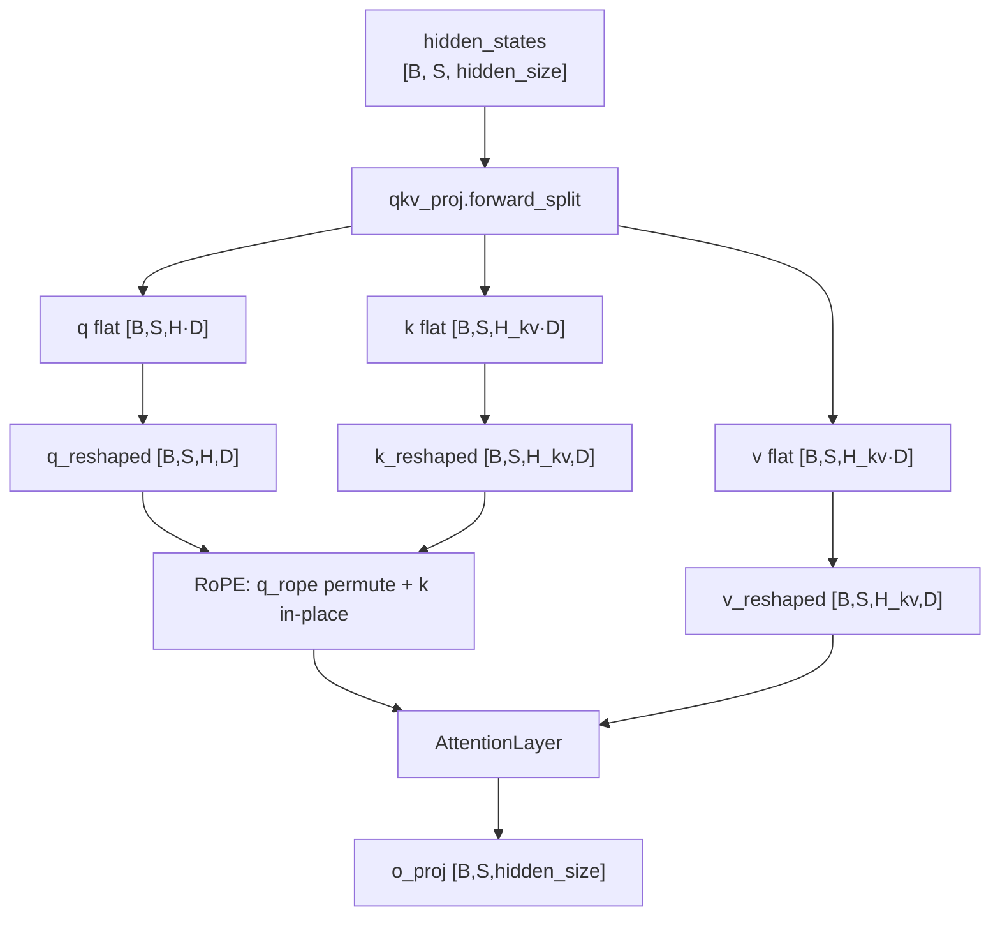
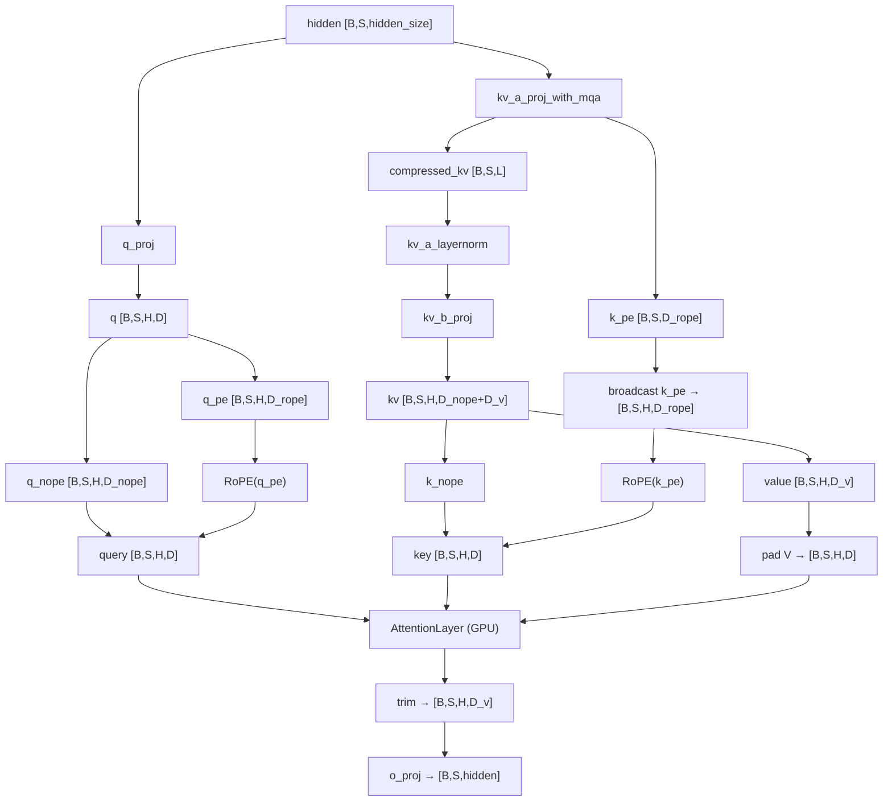
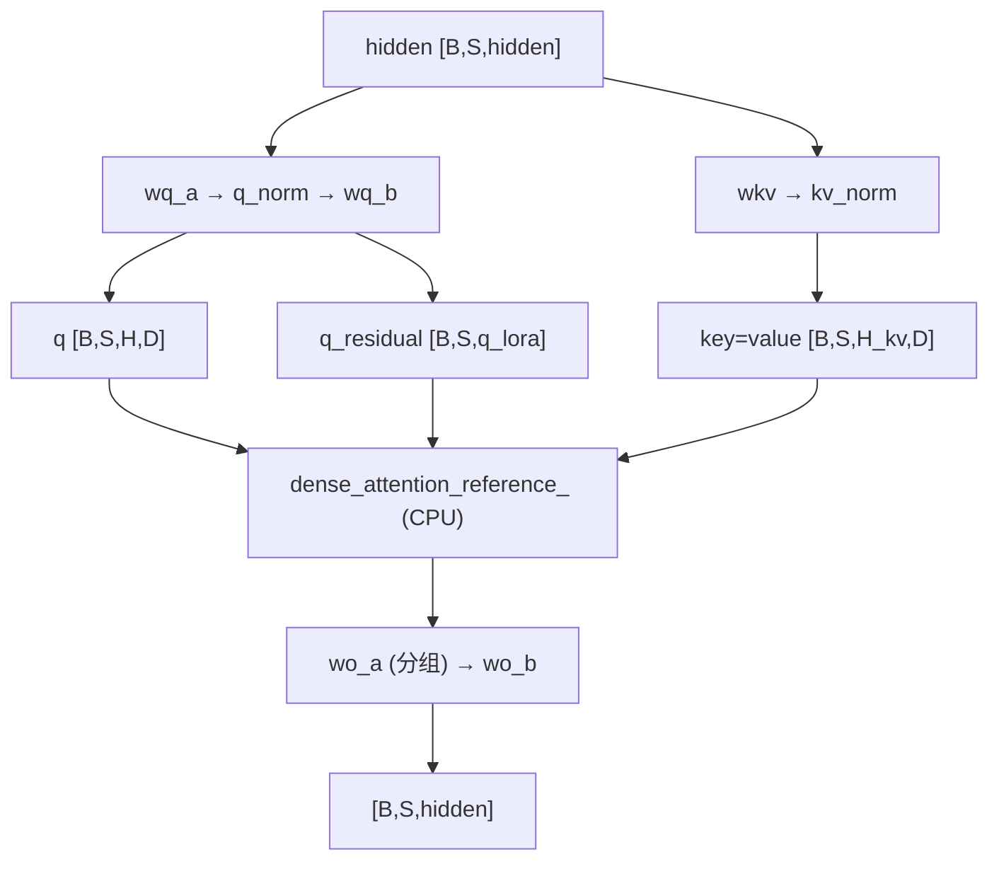
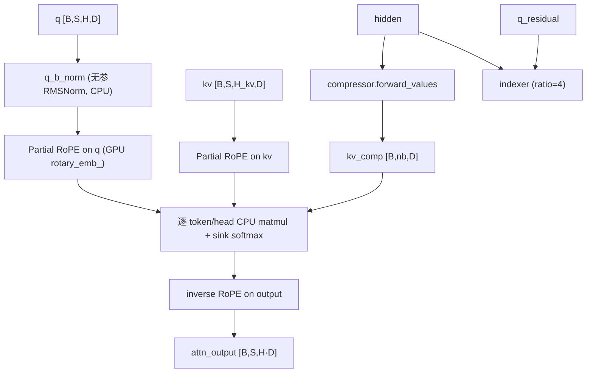

# InfiniLM Attention 对比

本文对比 InfiniLM C++ 实现中三个 Attention 模块的差异与 forward 数据流：

| 模块 | 路径 | 架构 |
|------|------|------|
| 普通 `Attention` | `csrc/layers/attention/attention.cpp` | 标准 MHA / GQA |
| `DeepseekV2Attention` | `csrc/models/deepseek_v2/deepseek_v2_attention.cpp` | MLA（Multi-head Latent Attention） |
| `DeepseekV4Attention` | `csrc/models/deepseek_v4/deepseek_v4_attention.cpp` | Shared-KV MQA + DSA（压缩 KV + Indexer + Sink） |

**详细对比章节：**

- [§A 普通 Attention vs DeepseekV2Attention（详细）](#a-普通-attention-vs-deepseekv2attention详细)
- [§3 DeepseekV2 Forward 数据流](#3-deepseekv2attention-forward-数据流)
- [§4 DeepseekV4 Forward 数据流](#4-deepseekv4attention-forward-数据流)

---

## 1. 总览对比表

| 维度 | 普通 Attention | DeepseekV2Attention | DeepseekV4Attention |
|------|----------------|---------------------|---------------------|
| Q 投影 | `QKVParallelLinear` 一次出 Q | `q_proj` 一次 `[H × (D_nope+D_rope)]` | `wq_a → q_norm → wq_b` 低秩 LoRA |
| K/V 投影 | 独立 `k_proj` / `v_proj` | `kv_a → norm → kv_b` 低秩展开 | `wkv → kv_norm`，**K=V 共享** |
| KV 头数 | `num_key_value_heads`（GQA） | 低秩共享后展开为 **H 头** | 默认 **1 头 MQA**（`num_key_value_heads=1`） |
| Head 维度 | Q/K/V 统一 `head_dim` | Q/K=`D_nope+D_rope`，V=`v_head_dim`（可更小） | 统一 `head_dim`，K=V |
| RoPE | Q/K **整头**旋转 | **Partial RoPE**：仅 `q_pe` / `k_pe` | Partial RoPE + 输出 **inverse RoPE** |
| RoPE θ | 单一 `rope_theta` | YaRN + **mscale²** 修正 scale | `rope_theta` + `compress_rope_theta` |
| Attention Sink | 无 | 无 | **每 head 可学习 `attn_sink`** |
| KV 压缩 | 无 | 无（仅 MLA 低秩） | `compressor`（ratio=4/128）+ `indexer`（ratio=4） |
| Sliding Window | 无（全序列 causal） | 无 | 有（`sliding_window`） |
| O 投影 | 单层 `o_proj` | 单层 `o_proj(H·D_v → hidden)` | **分组低秩** `wo_a → wo_b` |
| Attention 计算 | **`AttentionLayer` GPU** | **`AttentionLayer` GPU** | **`dense_attention_reference_` CPU**（`attn_` 未调用） |
| V 维度处理 | 直接进 kernel | pad 到 `q_head_dim`，输出 trim | 无 pad（K=V 同维） |

---

## 2. 模块组成对比

### 2.0 普通 Attention

```
Attention (layers/attention)
├── qkv_proj_           QKVParallelLinear     hidden → Q/K/V 三路并行
│                         ├── q_proj  → H · head_dim
│                         ├── k_proj  → H_kv · head_dim
│                         └── v_proj  → H_kv · head_dim
├── o_proj_             RowParallelLinear     H · head_dim → hidden
├── rotary_emb_         RoPE
└── attn_               AttentionLayer
                          num_heads = H
                          head_size = head_dim
                          num_kv_heads = H_kv   ← 真实 GQA 头数
                          scale = 1/sqrt(head_dim)
```

### 2.1 DeepseekV2Attention

```
DeepseekV2Attention
├── q_proj              ColumnParallelLinear   hidden → H·(D_nope+D_rope)
├── kv_a_proj_with_mqa  ReplicatedLinear       hidden → L + D_rope
├── kv_a_layernorm      RMSNorm                L 维
├── kv_b_proj           ColumnParallelLinear   L → H·(D_nope+D_v)
├── o_proj              RowParallelLinear      H·D_v → hidden
├── rotary_emb_         RoPE（YaRN）
└── attn_               AttentionLayer         num_kv_heads = num_heads
```

### 2.2 DeepseekV4Attention

```
DeepseekV4Attention
├── wq_a                ReplicatedLinear       hidden → q_lora_rank
├── q_norm              RMSNorm
├── wq_b                ColumnParallelLinear   q_lora → H·head_dim
├── wkv                 ReplicatedLinear       hidden → head_dim（K=V）
├── kv_norm             RMSNorm
├── wo_a                ColumnParallelLinear   分组 O 降维（o_groups）
├── wo_b                RowParallelLinear      o_lora·groups → hidden
├── attn_sink           Parameter [H]        attention sink  logits
├── compressor          DeepseekV4Compressor   ratio=4 或 128（按层）
├── indexer             DeepseekV4Indexer      ratio=4 时启用（stub/简化）
├── rotary_emb_         RoPE
└── attn_               AttentionLayer         已构造，forward **未使用**
```

---

## A. 普通 Attention vs DeepseekV2Attention（详细）

本节专述 **Qwen/Llama 类 GQA** 与 **DeepSeek V2 MLA** 在 InfiniLM 中的实现差异，含完整 forward shape 与 `AttentionLayer` 入参对比。

### A.1 设计目标与范式

| | 普通 Attention | DeepseekV2Attention |
|---|----------------|---------------------|
| 论文/架构 | 标准 Multi-Head / Grouped-Query Attention | Multi-head **Latent** Attention (MLA) |
| Q/K/V 关系 | 三路独立线性，K/V 可少于 Q（GQA） | Q 独立；K/V 经 **低秩瓶颈** 再展开 |
| 典型模型 | Qwen3、Llama、GPT-2 等 | DeepSeek V2 / V2-Lite / MoE-16B |
| RoPE | 全 head 维旋转 | **Partial RoPE**：nope 维不旋转 |
| 价值向量 V | 与 Q/K 同 `head_dim` | 独立 `v_head_dim`，可小于 Q/K 维 |

**MLA 直觉：** 先把 KV 压到 `kv_lora_rank` 维，再展开到各 head；`k_pe`（RoPE 部分）在 head 间 **共享**，减少 KV 参数量与（理论上的）cache  footprint。

---

### A.2 配置参数对照

| 配置项 | 普通 Attention | DeepseekV2Attention |
|--------|----------------|---------------------|
| `head_dim` | Q/K/V 统一 head 维 | 不直接使用；拆为 `qk_nope_head_dim` + `qk_rope_head_dim` |
| `num_attention_heads` | Q 头数 | Q 头数（同） |
| `num_key_value_heads` | KV 头数（GQA） | **不用于 AttentionLayer**；展开后 `num_kv_heads = num_heads` |
| `kv_lora_rank` | — | KV 低秩维 `L` |
| `qk_nope_head_dim` | — | K/Q 不旋转部分 |
| `qk_rope_head_dim` | — | K/Q RoPE 部分 |
| `v_head_dim` | — | V 有效维 `D_v` |
| `attention_bias` | QKV/o 可选 bias | 仅 `kv_a` / `o_proj` 可选 |
| `rope_scaling` | 可选 YaRN 等 | YaRN + **`mscale_all_dim` 修正 attention scale** |

**派生量（V2）：**

```
q_head_dim = qk_nope_head_dim + qk_rope_head_dim   (= D)
AttentionLayer.head_size = q_head_dim
o_proj 输入维 = num_heads × v_head_dim
```

---

### A.3 线性层与参数量结构

#### 普通 Attention — 一次 QKV

```cpp
qkv_proj_ = QKVParallelLinear(
    hidden_size, head_dim,
    total_num_heads, total_num_kv_heads, ...);

// 输出维（全局，TP 前）:
//   Q: num_heads × head_dim
//   K: num_kv_heads × head_dim
//   V: num_kv_heads × head_dim
```

- **ColumnParallel**：Q/K/V 在 head 维按 TP 切分
- **一次 GEMM**（融合 QKV）或等价三路权重

#### DeepseekV2 — 四段 MLA 投影

```cpp
q_proj:              hidden → num_heads × q_head_dim          // ColumnParallel
kv_a_proj_with_mqa:  hidden → kv_lora_rank + qk_rope_head_dim // Replicated（全 rank 复制）
kv_a_layernorm:      RMSNorm(kv_lora_rank)
kv_b_proj:           kv_lora_rank → num_heads × (D_nope + D_v) // ColumnParallel
o_proj:              num_heads × v_head_dim → hidden          // RowParallel
```

**对比要点：**

| | 普通 | V2 |
|---|------|-----|
| Q 路径 | 1 层 | 1 层（`q_proj`） |
| KV 路径 | 2 层（k + v） | 3 层（`kv_a` + norm + `kv_b`），且 **K/V 同源** 再 split |
| KV 是否 TP 切分 | K/V head 维切分 | `kv_a` **不切分**；`kv_b` 在 head 维切分 |
| o_proj 输入 | `H × head_dim` | `H × v_head_dim`（常更小） |

---

### A.4 AttentionLayer 构造差异

两者共用 `infinilm::layers::attention::AttentionLayer`，但入参语义不同：

| 参数 | 普通 Attention | DeepseekV2Attention |
|------|----------------|---------------------|
| `num_heads` | `H`（TP 后本地 Q 头） | `H`（TP 后本地 Q 头） |
| `head_size` | `head_dim` | `q_head_dim`（= D_nope + D_rope） |
| `scale` | `1/sqrt(head_dim)` | `deepseek_v2_attention_softmax_scale()`，可含 **mscale²** |
| `num_kv_heads` | `H_kv`（真实 GQA） | **`H`（与 Q 相同）** |

**GQA vs「伪 MHA」：**

- **普通**：`StaticAttentionImpl` 内 `ngroup = num_heads / num_kv_heads`，K/V 按 GQA 分组 broadcast
- **V2**：低秩共享已在 `kv_a` / `k_pe broadcast` 完成；传入 kernel 的 K/V 已是 **每头独立** 的 `[H, D]`，故 `num_kv_heads = H`

---

### A.5 Forward 总览（并排）

```
┌─ 普通 Attention ─────────────────────────────────────────────┐
│ hidden [B,S,Hid]                                           │
│   → QKVParallelLinear → q,k,v                              │
│   → view → q[B,S,H,D], k[B,S,H_kv,D], v[B,S,H_kv,D]       │
│   → RoPE(整头 Q), RoPE(整头 K)                             │
│   → AttentionLayer(q, k, v)     // GQA inside              │
│   → o_proj → [B,S,Hid]                                     │
└────────────────────────────────────────────────────────────┘

┌─ DeepseekV2Attention ──────────────────────────────────────┐
│ hidden [B,S,Hid]                                           │
│   → q_proj → q[B,S,H,D] → split nope|pe                    │
│   → kv_a → [L|k_pe] → norm → kv_b → k_nope, v[D_v]        │
│   → RoPE(q_pe), RoPE(broadcast(k_pe))                      │
│   → cat → q,k [B,S,H,D]; pad(v)→[B,S,H,D]                  │
│   → AttentionLayer(q,k,v_pad)   // num_kv_heads=H          │
│   → trim v → [B,S,H,D_v] → o_proj → [B,S,Hid]              │
└────────────────────────────────────────────────────────────┘
```

---

### A.6 普通 Attention — Static Forward 逐步

入口：`Attention::forward_static_(position_ids, hidden_states)`



| 步骤 | 代码位置 | 输入 Shape | 输出 Shape |
|------|----------|------------|------------|
| 1. QKV 投影 | `forward_split` | `[B,S,hidden]` | q:`[B,S,H·D]`, k/v:`[B,S,H_kv·D]` |
| 2. reshape | `view` | flat | `[B,S,H,D]`, `[B,S,H_kv,D]`, `[B,S,H_kv,D]` |
| 3. position | `position_ids` | `[B,S]` 或 `[S]` | 取 batch0 → `[S]` |
| 4. RoPE Q | `rotary_emb_->forward(q_rope, q_reshaped, pos)` | q: `[B,S,H,D]` | 写入 permute 缓冲 |
| 4. RoPE K | `rotary_emb_->forward(k_reshaped, pos, true)` | k: `[B,S,H_kv,D]` | in-place |
| 5. Attention | `attn_->forward(q_rope, k, v)` | 见下表 | `[B,S,H·D]` |
| 6. o_proj | `o_proj_->forward` | `[B,S,H·D]` | `[B,S,hidden]` |

**传入 AttentionLayer 的 layout（Static）：**

| Tensor | 进入 `attn_` 前 | `StaticAttentionImpl` 内 permute 后 |
|--------|-----------------|-------------------------------------|
| Q | `[B,S,H,D]`（经 q_rope 缓冲） | `[B,H,S,D]` |
| K | `[B,S,H_kv,D]` | `[B,H_kv,S,D]` |
| V | `[B,S,H_kv,D]` | `[B,H_kv,S,D]` |

**GQA 在 kernel 内：**

```81:84:csrc/layers/attention/backends/static_attn.cpp
        size_t ngroup = num_heads_ / num_kv_heads_;
        auto Q = q_reshaped->view({batch_size * num_kv_heads_, ngroup * seq_len, head_dim_});
        auto K = k_total->view({batch_size * num_kv_heads_, total_seq_len, head_dim_});
        auto V = v_total->view({batch_size * num_kv_heads_, total_seq_len, head_dim_});
```

每个 KV 头服务 `ngroup = H / H_kv` 个 Q 头。

---

### A.7 DeepseekV2Attention — Static Forward 逐步

入口：`DeepseekV2Attention::forward_static_(position_ids, hidden_states)`

| 步骤 | 操作 | 输出 Shape |
|------|------|------------|
| 1 | `q_proj(hidden)` → view | `[B,S,H,D]`，`D=D_nope+D_rope` |
| 2 | split Q | `q_nope [B,S,H,D_nope]`, `q_pe [B,S,H,D_rope]` |
| 3 | `kv_a_proj(hidden)` | `[B,S,L+D_rope]` |
| 4 | split compressed | `compressed_kv [B,S,L]`, `k_pe [B,S,D_rope]` |
| 5 | `kv_a_layernorm` + `kv_b_proj` | `[B,S,H,D_nope+D_v]` |
| 6 | split KV | `k_nope [B,S,H,D_nope]`, `value [B,S,H,D_v]` |
| 7 | RoPE | `q_pe`, `k_pe`→broadcast→`[B,S,H,D_rope]` |
| 8 | cat | `query/key [B,S,H,D]` |
| 9 | pad V | `value_padded [B,S,H,D]`（尾部填 0） |
| 10 | `attn_->forward` | `[B,S,H·D]`（kernel 按 D 维） |
| 11 | `trim_value_padding_` | `[B,S,H·D_v]` |
| 12 | `o_proj` | `[B,S,hidden]` |

**Partial RoPE 数据布局（单 head）：**

```
head 维布局:  [ q_nope | q_pe ]  仅 q_pe 做 RoPE
              [ k_nope | k_pe ]  k_pe 先 [B,S,1,D_rope] 再 broadcast 到 H
```

**V pad / trim 原因：** `AttentionLayer` 的 `head_size` 固定为 `q_head_dim`；V 有效维为 `v_head_dim` 时需 pad 进 kernel，输出后再 narrow 掉 padding。

```117:121:csrc/models/deepseek_v2/deepseek_v2_attention.cpp
    auto value_padded = infinicore::op::pad(value_states, {0, static_cast<int>(q_head_dim_ - v_head_dim_)}, "constant", 0.0);
    auto attn_output = attn_->forward(query_states, key_states, value_padded);
    auto trimmed_output = trim_value_padding_(attn_output);
    return o_proj_->forward(trimmed_output);
```

---

### A.8 Paged Forward 对比

两者均在 `attention_backend != STATIC_ATTN` 时走 paged 路径，且 **要求 `batch_size == 1`**（多请求沿 seq 维拼成一条）。

| 步骤 | 普通 Attention | DeepseekV2Attention |
|------|----------------|---------------------|
| hidden | `[1, S, hidden]` | `[1, S, hidden]` |
| Q shape | `[S, H, D]` | `[S, H, D]` |
| K shape | `[S, H_kv, D]` | `[S, H, D]`（展开后） |
| V shape | `[S, H_kv, D]` | `[S, H, D]`（pad 后） |
| RoPE | in-place on `[S,H(*),D]` | 仅 pe 部分；cat 维为 **dim=2** |
| Attention | `paged_caching_` + prefill/decode | 同 |
| 输出 | `[1, S, H·D]` | trim 后 `[1, S, H·D_v]` |

**Layout 差异：** Static 保留 batch 维 `[B,S,H,D]`；Paged 去掉 batch，`cat` 在 dim=2（V2）而非 dim=3（Static）。

---

### A.9 RoPE 行为对比

| | 普通 Attention | DeepseekV2Attention |
|---|----------------|---------------------|
| 作用范围 | Q、K 的 **全部** `head_dim` | 仅 **`qk_rope_head_dim`** 尾部 |
| Q RoPE 调用 | `forward(q_rope, q_reshaped, pos)` 或 in-place | `forward(q_pe, pos, true)` 仅 pe 块 |
| K RoPE | 每 KV 头独立 | `k_pe` **共享**，broadcast 后各 head 相同 pe |
| V RoPE | 无 | 无 |
| position_ids | `[B,S]`→`[S]` | 同（`position_ids_for_rope_`） |
| Scale 联动 | 仅 `1/sqrt(D)` | YaRN 时 `scale × mscale²`（见 `deepseek_v2_utils.hpp`） |

---

### A.10 Softmax Scale

**普通：**

```cpp
float scaling = 1.0f / std::sqrt(static_cast<float>(head_dim_));
```

**V2：**

```10:34:csrc/models/deepseek_v2/deepseek_v2_utils.hpp
inline float deepseek_v2_attention_softmax_scale(...) {
    float scale = 1.0f / std::sqrt(q_head_dim);
    // 若 rope_scaling 含 mscale_all_dim != 0:
    //   scale *= yarn_get_mscale(factor, mscale_all_dim) ^ 2
    return scale;
}
```

长上下文 YaRN 配置下，V2 的 attention logits 会额外乘 **mscale 平方**，普通 Attention 若也用 YaRN RoPE，但 scale 仍可能只是 `1/sqrt(head_dim)`（取决于 `get_rope` 与模型 config，二者需分开看）。

---

### A.11 KV Cache 与 AttentionLayer 内部

两者 forward 路径均调用同一套 backend：

```28:39:csrc/layers/attention/backends/attention_layer.cpp
    return impl_ptr->forward(*this, query, key, value, kv_cache, attn_metadata);
```

| | 普通 Attention | DeepseekV2Attention |
|---|----------------|---------------------|
| 写入 cache 的 K/V | `[H_kv, D]` per token | `[H, D]` per token（展开 + pad 后的 V） |
| head_size（cache slot） | `head_dim` | `q_head_dim` |
| GQA 在 cache | 只存 `H_kv` 头 | 存满 `H` 头 |

**实现备注：** `deepseek_v2_allocate_kv_cache_tensors.cpp` 按 **MLA 压缩维**（`kv_lora_rank + qk_rope_head_dim`，1 个 KV 头）分配 buffer，与当前 `forward` 写入 **展开后** `[H, q_head_dim]` 的路径在设计上可能尚未完全对齐；推理若以 `DeepseekV2Attention` forward 为准，实际 cache 布局以 `AttentionLayer` 收到的 tensor 为准。

---

### A.12 权重命名（Checkpoint 加载参考）

| HF / 常见命名 | 普通 Attention | DeepseekV2Attention |
|---------------|----------------|---------------------|
| Q | `q_proj.weight` | `q_proj.weight` |
| K | `k_proj.weight` | `kv_a_proj_with_mqa` + `kv_b_proj`（K 部分） |
| V | `v_proj.weight` | `kv_b_proj`（V 部分） |
| KV norm | — | `kv_a_layernorm.weight` |
| O | `o_proj.weight` | `o_proj.weight` |

V2 的 `kv_a_proj_with_mqa` 同时产出低秩 KV 与 `k_pe`；`kv_b_proj` 一行权重按 head 切成 `k_nope` 与 `v`。

---

### A.13 差异小结

| 主题 | 普通 Attention | DeepseekV2Attention |
|------|----------------|---------------------|
| 复杂度 | 低；标准 GQA | 高；MLA 四段投影 + partial RoPE |
| KV 参数量 | `2 × H_kv × D × hidden` 量级 | `(L+D_rope)×hidden + L×H×(D_nope+D_v)`，通常更省 |
| Kernel 接口 | 直接 Q/K/V | 需 cat/pad/trim 适配同一 `AttentionLayer` |
| TP 行为 | Q/K/V 均 head 并行 | `kv_a` 复制；`kv_b`/Q/o 并行 |
| 生产成熟度 | ✅ 完整 GPU 路径 | ✅ 完整 GPU 路径（与 V4 不同） |

---

## 3. DeepseekV2Attention Forward 数据流

入口：`forward(positions, hidden_states)` → `forward_static_` / `forward_paged_`。

符号：`B`=batch，`S`=seq_len，`H`=本地 Q 头数，`L`=kv_lora_rank，`D=D_nope+D_rope`，`D_v`=v_head_dim。

### 3.1 Static 路径



**逐步 Shape：**

| 步骤 | Tensor | Shape |
|------|--------|-------|
| 输入 | `hidden_states` | `[B, S, hidden_size]` |
| Q | `q_proj` → view | `[B, S, H, D]` |
| KV 压缩 | `kv_a` | `[B, S, L + D_rope]` |
| KV 展开 | `kv_b` → split | `k_nope [B,S,H,D_nope]`, `v [B,S,H,D_v]` |
| Partial RoPE | 仅 pe 部分 | `k_pe` 共享后 broadcast 到 H 头 |
| Attention 输入 | Q/K/V | `[B,S,H,D]`, `[B,S,H,D]`, `[B,S,H,D]`（V pad） |
| Attention 输出 | trim 后 | `[B, S, H·D_v]` |
| 输出 | `o_proj` | `[B, S, hidden_size]` |

**Softmax scale：** `1/sqrt(D)`，若配置 YARN 且 `mscale_all_dim≠0` 则乘 **mscale²**。

### 3.2 Paged 路径

与 Static 算法相同，layout 去掉 batch 维：`[S,H,D]`、`[S,H,D_v]`，要求 `batch_size==1`。

---

## 4. DeepseekV4Attention Forward 数据流

入口：`forward(positions, hidden_states)` → 同样分 static/paged，但 **两者都走 `dense_attention_reference_`**（CPU float 参考实现）。

符号：`H`=本地 Q 头数，`H_kv`=KV 头数（通常 1），`D=head_dim`，`D_rope=qk_rope_head_dim`，`nb`=压缩块数。

### 4.1 投影阶段（GPU）



| 步骤 | Tensor | Shape |
|------|--------|-------|
| Q LoRA | `wq_a → q_norm → wq_b` | `q [B,S,H,D]`，`q_residual [B,S,q_lora_rank]` |
| 共享 KV | `wkv → kv_norm` | `[B,S,H_kv,D]`，`key_states = value_states` |
| 参考注意力 | `dense_attention_reference_` | 见 4.2 |
| O 投影 | `wo_a` 按 `o_groups` 分组 linear | `[B,S,H·D]` → `[B,S,o_groups·o_lora]` → `wo_b` |

### 4.2 参考注意力内部（CPU，`dense_attention_reference_`）



**KV 轴构成：** 对每个 query 位置 `t`，attention logits 来自两部分：

1. **压缩块**（`nb` 个）：`compressor` 输出的 `kv_comp`，可选经 `indexer` top-k 筛选（ratio=4）
2. **Sliding window**（最多 `sliding_window` 个 token）：原始 `kv` 序列局部窗口

**Sink softmax：** logits 末尾追加 `attn_sink[h]`，与所有 key logits 一起做 softmax，再 **丢弃 sink 维度**（类似 gpt-oss 风格）。

**Inverse RoPE：** attention 输出后对 rope 切片施加 **共轭旋转**（`-sin`），undo KV 上的 RoPE 再进 O 投影。

**压缩块 RoPE：** 对 `kv_comp` 用 `compress_rope_theta_` 在块位置 `block * ratio + (ratio-1)` 做 partial RoPE。

### 4.3 按 `compress_ratio` 分层

| `compress_ratios[layer]` | Compressor | Indexer | 行为 |
|--------------------------|------------|---------|------|
| 0 | 无 | 无 | 仅 sliding window + sink |
| 4（CSA） | 有 | 有（简化） | 压缩块 + indexer 筛选 + SW |
| 128（HCA） | 有 | 无 | 全量压缩块 + SW |

### 4.4 未使用的路径

| 组件 | 状态 |
|------|------|
| `attn_` (AttentionLayer) | 构造完成，**forward 从未调用** |
| `dense_attention_()` | GPU matmul+softmax，**死代码** |
| `forward_paged_` | 与 static 相同走 CPU reference，**非真正 paged kernel** |

启动时会 warn：`DeepseekV4Attention uses a reference CPU path for V4 sliding/compressed attention.`

---

## 5. V2 vs V4 核心差异详解

### 5.1 注意力范式：MLA vs Shared-KV MQA + DSA

**V2（MLA）** 的核心是 **KV 低秩分解**：

```
hidden ──kv_a──► [L | k_pe] ──norm──► kv_b ──► [K_nope | V]  (展开到 H 头)
```

- 参数量与 KV cache 潜力优于标准 MHA
- 进入 `AttentionLayer` 时是 **完整 H 头** 的 Q/K/V（V pad 到 D）

**V4（Shared-KV MQA）** 的核心是 **单 KV 头 + 序列压缩**：

```
hidden ──wkv──► kv [1 × D]     (K = V)
hidden ──compressor──► nb 个压缩 KV 块
query  ──indexer──► top-k 块索引 (CSA)
```

- Q 仍用 LoRA（`wq_a/b`），但 KV **不展开**到 H 头（MQA）
- 长程依赖靠 **压缩块** 而非 MLA 低秩展开
- 短程靠 **sliding window**

### 5.2 Q 投影

| | V2 | V4 |
|---|----|----|
| 结构 | 单层 `q_proj` | 两层 `wq_a → q_norm → wq_b` |
| 中间维 | 无 | `q_lora_rank` |
| Q 后 norm | 无 | `q_norm`（LoRA 秩上）；参考路径还有 **q_b_norm**（head 上，CPU） |

### 5.3 RoPE

| | V2 | V4 |
|---|----|----|
| 方式 | Partial：nope + pe 拼接 | Partial：仅尾部 `qk_rope_head_dim` |
| K 的 pe | `k_pe` **跨 head 共享**，broadcast 后 RoPE | 单 KV 头直接 RoPE |
| 输出 | 无 inverse RoPE | **inverse RoPE** on attn output |
| 压缩 KV | 无 | 独立 `compress_rope_theta` |

### 5.4 Attention 计算

| | V2 | V4 |
|---|----|----|
| 实现 | `AttentionLayer` → Static/Paged/Flash GPU kernel | `dense_attention_reference_` CPU 三重循环 |
| KV 范围 | 全历史（causal） | sliding window **+** 压缩块 |
| Sink | 无 | `attn_sink[h]` 参与 softmax |
| Indexer | 无 | ratio=4 时 top-k 选块（C++ 为简化版） |
| GQA/MQA | 伪 MHA（H_kv=H） | 真 MQA（H_kv=1，GQA 在 `dense_attention_` 中但未启用） |

### 5.5 O 投影

| | V2 | V4 |
|---|----|----|
| 结构 | 单层 `o_proj` | `wo_a`（按 `o_groups` 分组）→ `wo_b` |
| 输入维 | `H · v_head_dim` | `H · head_dim` |
| 动机 | 标准输出混合 | 超大 `H·D` 时用分组降维（V4-Flash/Pro 规模） |

### 5.6 Softmax Scale

- **V2：** `deepseek_v2_attention_softmax_scale()`，YARN mscale 修正
- **V4：** 固定 `1/sqrt(head_dim_)`，**无** mscale 修正

---

## 6. 并排 Forward 对比（Static）

```
DeepseekV2Attention:
  hidden [B,S,Hid]
    → q[B,S,H,D]; kv_a→norm→kv_b→k,v; k_pe broadcast
    → Partial RoPE(q_pe, k_pe)
    → cat → q,k [B,S,H,D]; pad(v)→[B,S,H,D]
    → AttentionLayer (GPU, KV cache)
    → trim [B,S,H,D_v] → o_proj → [B,S,Hid]

DeepseekV4Attention:
  hidden [B,S,Hid]
    → wq_a→q_norm→wq_b → q[B,S,H,D], q_residual
    → wkv→kv_norm → kv[B,S,1,D] (K=V)
    → dense_attention_reference_ (CPU):
        q_b_norm → Partial RoPE(q,k)
        compressor → kv_comp[nb,D]; indexer top-k (ratio=4)
        logits = [压缩块 nb | sliding window S] + sink
        softmax → weighted sum → inverse RoPE
    → wo_a (grouped) → wo_b → [B,S,Hid]
```

---

## 7. 三模块关系速览

- **普通 Attention**：Qwen/Llama 类 GQA 基线 → 详见 [§A](#a-普通-attention-vs-deepseekv2attention详细)
- **DeepseekV2Attention**：MLA 专化，仍复用同一 `AttentionLayer` GPU 路径
- **DeepseekV4Attention**：DSA 专化，当前 **未** 接入 `AttentionLayer` 生产路径

---

## 8. 实现成熟度

| 模块 | GPU Attention | KV Cache | 压缩/Indexer | 生产可用性 |
|------|---------------|----------|--------------|------------|
| 普通 Attention | ✅ | ✅ Static/Paged | — | ✅ |
| DeepseekV2Attention | ✅ | ✅ Static/Paged | — | ✅ |
| DeepseekV4Attention | ❌ CPU reference | ❌ 未走 `attn_` | ⚠️ 简化 | ⚠️ 对齐/性能待完善 |

**V4 待办（若要对齐官方/vLLM/SGLang）：**

1. 将 sliding/compressed 路径接入 `AttentionLayer` 或专用 sparse kernel
2. 完整实现 `DeepseekV4Indexer` 并接入 CSA top-k
3. `forward_paged_` 使用 paged sparse MLA + compressor cache
4. 启用 `dense_attention_` 或等价 GPU 路径作为 sliding-only 层 fast path

---

## 9. 源码索引

| 文件 | 说明 |
|------|------|
| `csrc/layers/attention/attention.cpp` | 普通 GQA Attention |
| `csrc/layers/attention/backends/attention_layer.cpp` | 共享 AttentionLayer 调度 |
| `csrc/models/deepseek_v2/deepseek_v2_attention.cpp` | V2 MLA |
| `csrc/models/deepseek_v2/deepseek_v2_utils.hpp` | V2 YARN mscale |
| `csrc/models/deepseek_v4/deepseek_v4_attention.cpp` | V4 DSA（CPU reference） |
| `csrc/models/deepseek_v4/deepseek_v4_compressor.cpp` | KV 压缩 |
| `csrc/models/deepseek_v4/deepseek_v4_indexer.cpp` | Lightning Indexer（stub） |
