**User**

@csrc/models/deepseek_v4 请梳理deepseek_v4中的各个模块，绘制一个关系层级图

---

**Cursor**

## InfiniLM DeepSeek V4 模块梳理

`csrc/models/deepseek_v4/` 共 **22 个文件、11 个逻辑模块**，整体是 **MHC（Multi-Head Composition）+ MLA 注意力 + MoE FFN** 架构。

---

## 1. 整体层级关系

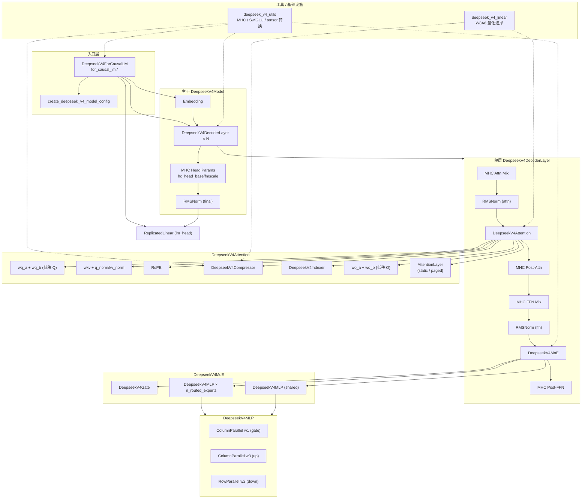

---

## 2. 文件 → 模块对照

| 文件 | 类 / 职责 | 角色 |
|------|-----------|------|
| `for_causal_lm.*` | `DeepseekV4ForCausalLM` | 模型入口，注册到 `INFINILM_REGISTER_CAUSAL_LM_MODEL` |
| `model.*` | `DeepseekV4Model` | Token embed → N 层 Decoder → MHC head → 最终 Norm |
| `decoder_layer.*` | `DeepseekV4DecoderLayer` | 单层：MHC → Attn → MHC → MoE → MHC |
| `attention.*` | `DeepseekV4Attention` | MLA 风格注意力 + KV 压缩 + static/paged 两路径 |
| `compressor.*` | `DeepseekV4Compressor` | 序列维 KV 压缩（`wkv`/`wgate`/`ape`/`norm`） |
| `indexer.*` | `DeepseekV4Indexer` | 压缩注意力索引权重（内含一个 Compressor） |
| `moe.*` | `DeepseekV4MoE` | 路由 MoE + 共享专家 |
| `gate.*` | `DeepseekV4Gate` | 专家路由 gate（`weight`/`bias`/`tid2eid`） |
| `mlp.*` | `DeepseekV4MLP` | SwiGLU 专家 MLP（`w1/w2/w3`） |
| `linear.*` | 工具函数 | 判断是否启用 W8A8、选择量化 backend |
| `utils.*` | 工具函数 | **MHC** 混合、`expand_hc_stream`、SwiGLU、tensor 转换 |

---

## 3. 前向数据流

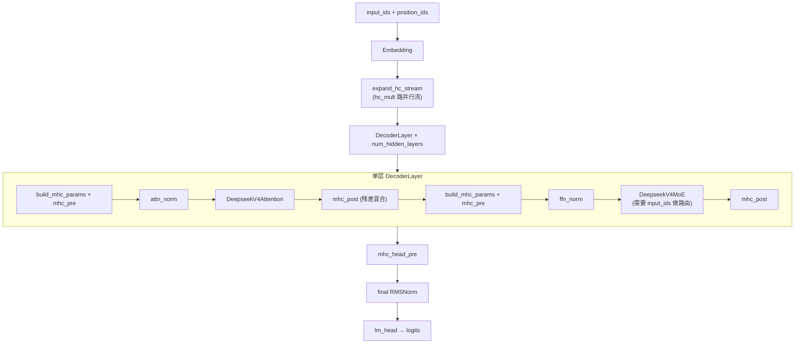

---

## 4. 子模块细节

### 4.1 `DeepseekV4Attention`（MLA + 压缩 KV）

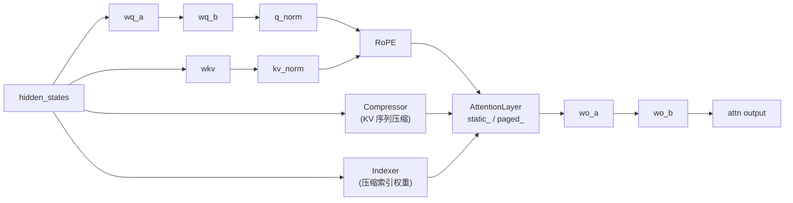

- **低秩投影**：`wq_a→wq_b`（Q）、`wo_a→wo_b`（O）
- **KV 压缩**：`compress_ratio > 0` 时启用 `Compressor` / `Indexer`
- **推理路径**：`forward_static_`（静态 KV cache）/ `forward_paged_`（Paged Attention）
- **当前状态**：部分 SW 路径仍用 CPU reference dense attention（代码中有 warn）

### 4.2 `DeepseekV4MoE`

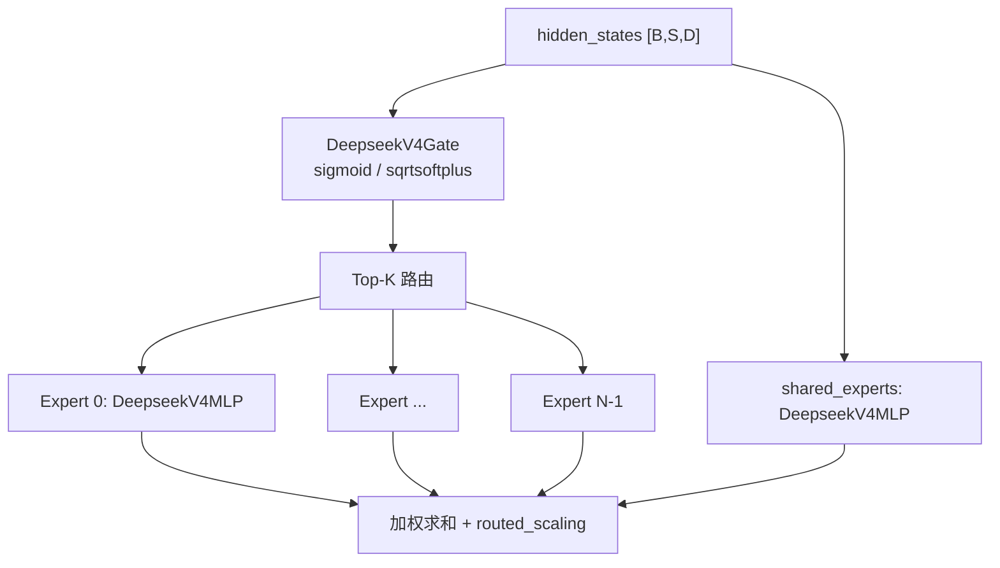

- 路由在 CPU 上实现（`forward_cpu_routed_`）
- 每个 expert 是标准 **SwiGLU MLP**（`w1=gate, w3=up, w2=down`）

### 4.3 MHC（Multi-Head Composition）

贯穿 **Model / DecoderLayer / utils** 的核心机制：

| 位置 | 参数 | 作用 |
|------|------|------|
| `DeepseekV4Model` | `hc_head_base/fn/scale` | 输出前 head 级 MHC 混合 |
| `DeepseekV4DecoderLayer` | `hc_attn_*` | Attention 前/后流混合 |
| `DeepseekV4DecoderLayer` | `hc_ffn_*` | FFN 前/后流混合 |
| `utils` | `build_mhc_params`, `mhc_pre/post`, `expand_hc_stream` | Sinkhorn 归一化混合逻辑 |

`hc_mult` 决定并行 hidden stream 数量；embed 后通过 `expand_hc_stream` 扩展维度。

---

## 5. 外部依赖（非 v4 目录）

| 依赖 | 用途 |
|------|------|
| `infinilm::InfinilmModel` | Causal LM 基类 |
| `layers/linear/*` | Column/Row/Replicated Parallel Linear |
| `layers/attention/AttentionLayer` | 实际 attention kernel 调度 |
| `layers/rotary_embedding` | RoPE 创建 |
| `infinicore::nn::Embedding/RMSNorm/RoPE` | 基础 NN 模块 |
| `quantization::CompressedTensors` | W8A8（经 `deepseek_v4_linear` 选择） |

---

## 6. 模块依赖简图（仅 v4 内部）

```
DeepseekV4ForCausalLM
├── DeepseekV4Model
│   ├── Embedding / RMSNorm
│   └── DeepseekV4DecoderLayer[N]
│       ├── DeepseekV4Attention
│       │   ├── DeepseekV4Compressor
│       │   └── DeepseekV4Indexer → DeepseekV4Compressor
│       └── DeepseekV4MoE
│           ├── DeepseekV4Gate
│           ├── DeepseekV4MLP × n_experts
│           └── DeepseekV4MLP (shared)
├── ReplicatedLinear (lm_head)
├── deepseek_v4_utils (MHC / tensor)
└── deepseek_v4_linear (量化)

create_deepseek_v4_model_config (config 归一化)
```

---

## 7. 实现状态提示

| 模块 | 状态 |
|------|------|
| 整体骨架 / MHC / MoE 路由 | 已实现 |
| W8A8 Linear 选择 | 已实现（`deepseek_v4_linear`） |
| Attention GPU kernel | 部分路径仍为 CPU reference |
| KV Compressor / Indexer | 已实现（含 CPU float 路径） |
| Decode 重算 | `ForCausalLM` 缓存 `input_ids` 支持 recompute decode |

如需针对某个子模块（例如 `Attention` 的 static vs paged 分支，或 MHC 数学细节）做更细的流程图，可以指定模块名继续展开。

---


## Transformers DeepSeek V4 模块梳理

来源：`deepseek_v4_transformers/modeling_deepseek_v4.py`（由 `modular_deepseek_v4.py` 自动生成）。  
配置类 `DeepseekV4Config` 定义在 `configuration_deepseek_v4.py`（本仓库未 vendoring，运行时由 Transformers 包提供）。

整体架构与 InfiniLM C++ 版一致：**MHC 多流残差 + MLA 注意力 + MoE FFN**，但 Transformers 实现更完整（含 KV Cache 分层、Indexer、多种 attention backend 接口）。

---

### T1. 整体层级关系

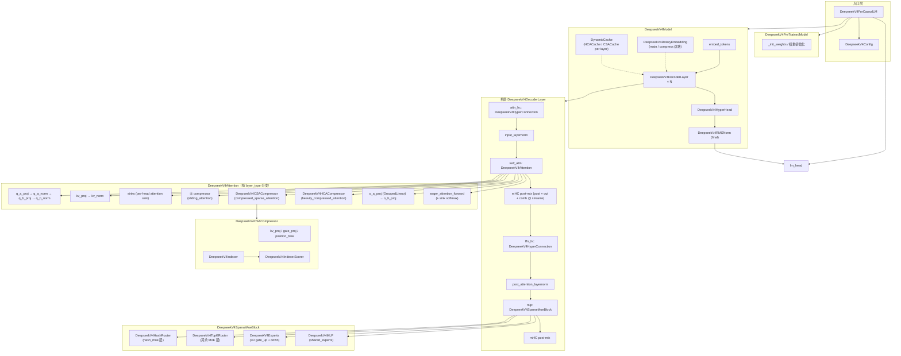

---

### T2. 类 → 职责对照

| 类名 | 职责 | 备注 |
|------|------|------|
| `DeepseekV4ForCausalLM` | Causal LM 入口 | `model` + `lm_head`；可选 router aux loss |
| `DeepseekV4Model` | 主干 | embed → N 层 Decoder → hc_head → norm |
| `DeepseekV4DecoderLayer` | 单层 Decoder | mHC → Attn → mHC → MoE → mHC |
| `DeepseekV4Attention` | MLA 注意力 | 共享 KV、partial RoPE、sink、低秩 O 投影 |
| `DeepseekV4HCACompressor` | HCA 压缩器 | ratio=128，非重叠窗口 |
| `DeepseekV4CSACompressor` | CSA 压缩器 | ratio=4，Ca/Cb 重叠窗口 + Indexer |
| `DeepseekV4Indexer` | Lightning Indexer | top-k 压缩块选择 |
| `DeepseekV4IndexerScorer` | Indexer 打分头 | `∑ w·ReLU(q·K)` |
| `DeepseekV4HyperConnection` | mHC 混合 | pre / post / comb + Sinkhorn |
| `DeepseekV4HyperHead` | 输出前 HC 坍缩 | Model 级单流化 |
| `DeepseekV4SparseMoeBlock` | MoE FFN | HashRouter 或 TopKRouter |
| `DeepseekV4HashRouter` | Hash 路由 | `tid2eid[input_ids]` 选 expert |
| `DeepseekV4TopKRouter` | Top-K 路由 | `score_fn` + `e_score_correction_bias` |
| `DeepseekV4Experts` | 路由专家集合 | 3D 权重 + `@use_experts_implementation` |
| `DeepseekV4MLP` | SwiGLU MLP | shared expert / 通用 MLP |
| `DeepseekV4RotaryEmbedding` | 多类型 RoPE | interleaved partial RoPE |
| `DeepseekV4GroupedLinear` | 分组输出投影 | o_a_proj 块对角 |
| `DeepseekV4HCACache` | HCA KV Cache | sliding window + compressor buffer |
| `DeepseekV4CSACache` | CSA KV Cache | 继承 HCA + indexer + overlap 状态 |
| `DeepseekV4RMSNorm` | 带权 RMSNorm | layernorm 用 |
| `DeepseekV4UnweightedRMSNorm` | 无参 RMSNorm | q_b_norm / mHC input norm |

辅助函数：`apply_rotary_pos_emb`、`rotate_half`、`eager_attention_forward`、`load_balancing_loss_func`。

---

### T3. 前向数据流

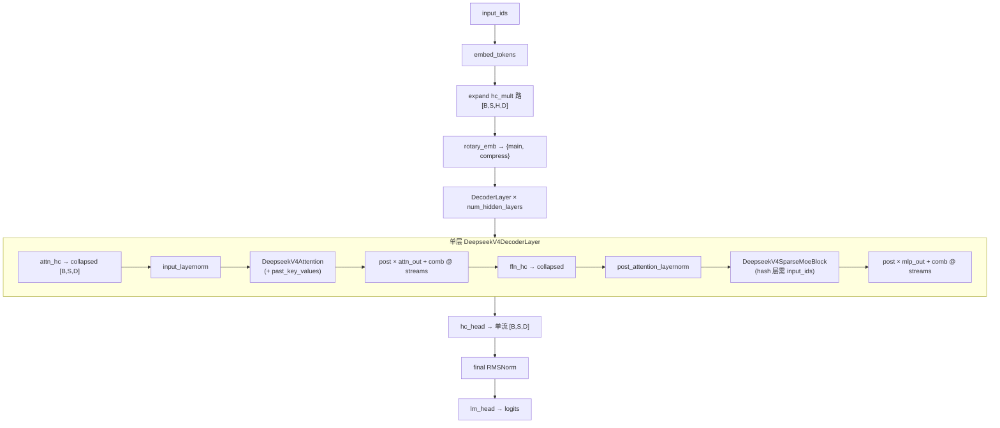

**Hidden shape 约定**：Decoder 内部全程 `[B, S, hc_mult, hidden_size]`；Attention / MoE 子层接收 mHC 坍缩后的 `[B, S, hidden_size]`。

---

### T4. Attention 子模块（按 `layer_types[layer_idx]`）

| `layer_type` | Compressor | Cache 类型 | RoPE 类型 | 特点 |
|--------------|------------|------------|-----------|------|
| `sliding_attention` | 无 | `DynamicSlidingWindowLayer` | `main` | 纯 sliding window + sink |
| `compressed_sparse_attention` | `DeepseekV4CSACompressor` | `DeepseekV4CSACache` | `compress` | ratio=4 + Lightning Indexer top-k |
| `heavily_compressed_attention` | `DeepseekV4HCACompressor` | `DeepseekV4HCACache` | `compress` | ratio=128，长程压缩 KV |

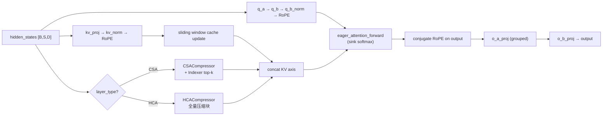

**Attention 内部投影**

| 子模块 | 参数名 | 作用 |
|--------|--------|------|
| Q 低秩 | `q_a_proj`, `q_a_norm`, `q_b_proj`, `q_b_norm` | LoRA 式 Q 投影 + 无参 norm |
| 共享 KV | `kv_proj`, `kv_norm` | MQA，`K=V` 同一 tensor |
| Sink | `sinks` | 每 head 可学习 attention sink |
| O 低秩 | `o_a_proj` (GroupedLinear), `o_b_proj` | 分组降维再混合到 hidden |

---

### T5. MoE 子模块（`DeepseekV4SparseMoeBlock`）

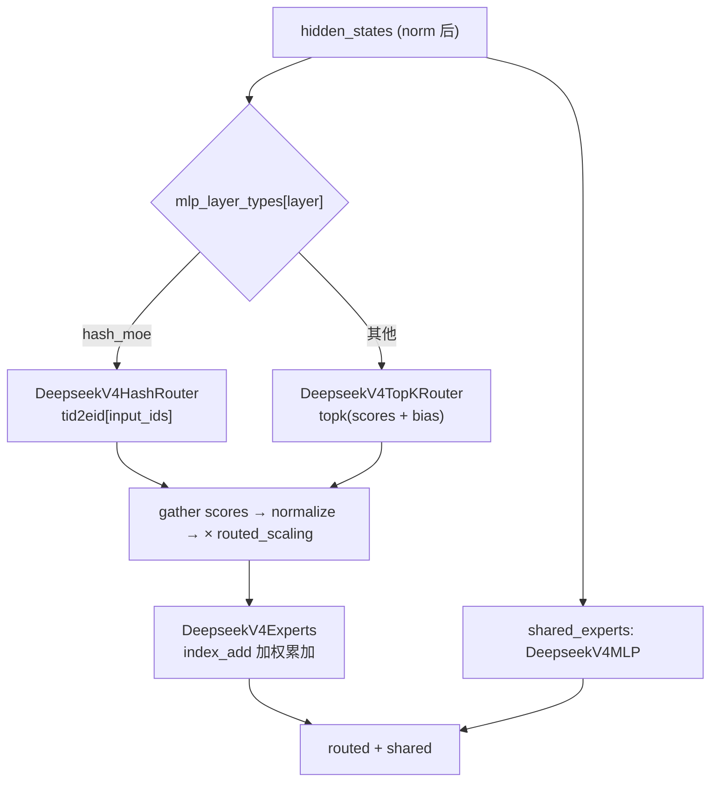

| 组件 | 关键参数 | 说明 |
|------|----------|------|
| `DeepseekV4HashRouter` | `weight`, `tid2eid` | 前若干层 hash 路由；expert 选择静态，权重仍来自 gate score |
| `DeepseekV4TopKRouter` | `weight`, `e_score_correction_bias` | `score_fn`（默认 `sqrtsoftplus`）+ bias 辅助 top-k |
| `DeepseekV4Experts` | `gate_up_proj`, `down_proj` | `[E, 2I, D]` / `[E, D, I]` 3D 权重 |
| `DeepseekV4MLP` | `gate/up/down_proj` | shared expert；`swiglu_limit` clamp |

---

### T6. MHC（Manifold-Constrained Hyper-Connection）

| 位置 | 类 / 参数 | 作用 |
|------|-----------|------|
| `DeepseekV4DecoderLayer.attn_hc` | `fn`, `base`, `scale` | Attention 前 collapse + 后 mix |
| `DeepseekV4DecoderLayer.ffn_hc` | 同上 | FFN 前 collapse + 后 mix |
| `DeepseekV4Model.hc_head` | `hc_fn`, `hc_base`, `hc_scale` | 输出前 HC 流坍缩为单流 |
| `DeepseekV4HyperConnection` | Sinkhorn `hc_sinkhorn_iters` | `comb` 矩阵双随机投影 |

mHC 输出三元组 `(post, comb, collapsed)`：

- `collapsed`：pre 权重加权求和 → 送入 norm + 子层
- 子层输出后：`post × sublayer_out + comb.T @ hidden_streams`

---

### T7. 模块依赖简图（Transformers 内部）

```
DeepseekV4ForCausalLM
├── DeepseekV4Model
│   ├── embed_tokens
│   ├── DeepseekV4RotaryEmbedding
│   ├── DeepseekV4DecoderLayer[N]
│   │   ├── DeepseekV4HyperConnection (attn_hc)
│   │   ├── DeepseekV4RMSNorm (input_layernorm)
│   │   ├── DeepseekV4Attention
│   │   │   ├── DeepseekV4HCACompressor  (HCA 层)
│   │   │   ├── DeepseekV4CSACompressor  (CSA 层)
│   │   │   │   └── DeepseekV4Indexer
│   │   │   │       ├── DeepseekV4IndexerScorer
│   │   │   │       └── (内置 kv/gate 压缩 + RoPE)
│   │   │   ├── DeepseekV4GroupedLinear (o_a_proj)
│   │   │   └── sinks
│   │   ├── DeepseekV4HyperConnection (ffn_hc)
│   │   ├── DeepseekV4RMSNorm (post_attention_layernorm)
│   │   └── DeepseekV4SparseMoeBlock
│   │       ├── DeepseekV4HashRouter | DeepseekV4TopKRouter
│   │       ├── DeepseekV4Experts
│   │       └── DeepseekV4MLP (shared_experts)
│   ├── DeepseekV4HyperHead
│   └── DeepseekV4RMSNorm (norm)
├── lm_head
└── load_balancing_loss_func (训练 aux loss)

Cache（推理时，按 layer_type 实例化）
├── DeepseekV4HCACache      ← heavily_compressed_attention
└── DeepseekV4CSACache      ← compressed_sparse_attention（继承 HCA + indexer/overlap）
```

---

### T8. InfiniLM C++ vs Transformers 模块映射

| Transformers | InfiniLM C++ | 对齐情况 |
|--------------|--------------|----------|
| `DeepseekV4ForCausalLM` | `DeepseekV4ForCausalLM` | 骨架一致 |
| `DeepseekV4Model` | `DeepseekV4Model` | 一致 |
| `DeepseekV4DecoderLayer` | `DeepseekV4DecoderLayer` | 一致 |
| `DeepseekV4HyperConnection` | `build_mhc_params` + `mhc_pre/post` | 数学等价，实现拆分不同 |
| `DeepseekV4HyperHead` | `mhc_head_pre` + `hc_head_*` | 一致 |
| `DeepseekV4Attention` | `DeepseekV4Attention` | C++ 部分路径为 CPU reference |
| `DeepseekV4CSACompressor` | `DeepseekV4Compressor` (ratio=4) | C++ 简化，无 Indexer 接入 |
| `DeepseekV4HCACompressor` | `DeepseekV4Compressor` (ratio=128) | 部分对齐 |
| `DeepseekV4Indexer` | `DeepseekV4Indexer` | C++ 为 stub |
| `DeepseekV4SparseMoeBlock` | `DeepseekV4MoE` | 路由逻辑对齐；C++ 无 fused kernel |
| `DeepseekV4HashRouter` | `DeepseekV4Gate.tid2eid` | 一致 |
| `DeepseekV4TopKRouter` | `DeepseekV4Gate.bias` + CPU top-k | 一致 |
| `DeepseekV4Experts` | `DeepseekV4MLP[]` | 结构等价，执行路径不同 |
| `DeepseekV4HCACache / CSACache` | `AttentionLayer` KV cache | C++ cache 未完整接入 CSA/HCA |


## vLLM DeepSeek V4 模块梳理

来源：`deepseek_v4_vllm/`（本仓库 vendored 的 vLLM 实现片段）。  
入口 `__init__.py` 按平台分发：`nvidia/`（默认 CUDA）、`amd/`（ROCm）、`xpu/`（Intel XPU）。

整体架构：**MHC TileLang 融合 + Sparse MLA Attention + MegaMoE / FusedMoE**，推理路径高度 kernel 化。

---

### V1. 整体层级关系

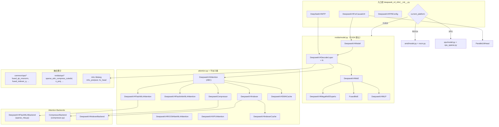

---

### V2. 目录 → 模块对照

| 路径 | 类 / 职责 | 角色 |
|------|-----------|------|
| `__init__.py` | 平台路由 + 导出 | 按 CUDA/ROCm/XPU 选择 `ForCausalLM` / `MTP` |
| `attention.py` | `DeepseekV4Attention` | MLA 注意力基类；Q/KV 投影 + compressor + indexer + forward_mqa |
| `compressor.py` | `DeepseekCompressor`, `CompressorBackend` | KV 压缩（C4/C128）+ paged cache 写入 |
| `sparse_mla.py` | `DeepseekV4FlashMLABackend` | Sparse MLA metadata / KV layout（fp8_ds_mla 584B） |
| `quant_config.py` | `DeepseekV4FP8Config` | FP8 量化配置 |
| `common/rope.py` | `build_deepseek_v4_rope` | YARN RoPE 构建 |
| `common/ops/*` | 融合算子 | qk norm、indexer q、compress quant cache 等 |
| `nvidia/model.py` | Model / DecoderLayer / MoE | **CUDA 主实现** |
| `nvidia/flashmla.py` | `DeepseekV4FlashMLAAttention` | FlashMLA sparse decode/prefill |
| `nvidia/flashinfer_sparse.py` | `DeepseekV4FlashInferMLAAttention` | FlashInfer 备选 backend |
| `nvidia/ops/*` | CuteDSL / Triton kernels | 压缩、indexer、o_proj、MegaMoE prepare |
| `nvidia/mtp.py` | `DeepSeekV4MTP` | 投机解码 draft 模型 |
| `amd/model.py`, `amd/rocm.py` | ROCm 变体 | Aiter sparse MLA backend |
| `xpu/model.py`, `xpu/xpu_sparse.py` | XPU 变体 | XPU sparse backend |

---

### V3. 前向数据流

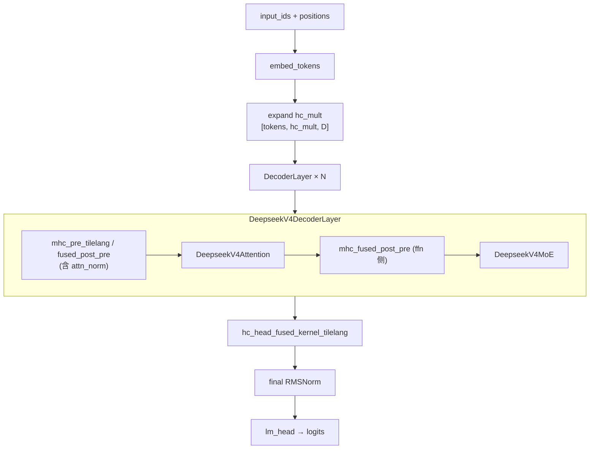

**Attention 内部（metadata 相关部分 eager break）：**

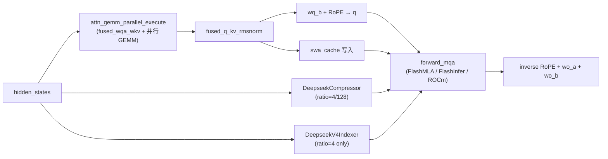

---

### V4. Attention 子模块（按 `compress_ratios[layer]`）

| compress_ratio | Compressor | Indexer | Backend | 说明 |
|----------------|------------|---------|---------|------|
| 1（sliding） | 无 | 无 | FlashMLA / FlashInfer | 纯 sliding window MQA |
| 4（CSA） | `DeepseekCompressor` | `DeepseekV4Indexer` | Sparse MLA + top-k | Lightning Indexer 选块 |
| 128（HCA） | `DeepseekCompressor` | 无 | Sparse MLA | 长程压缩 KV 全 attend |

平台子类选择（`nvidia/model.py::_select_dsv4_attn_cls`）：

- `FLASHINFER_MLA_SPARSE_DSV4` → `DeepseekV4FlashInferMLAAttention`
- 默认 → `DeepseekV4FlashMLAAttention`

---

### V5. MoE 子模块（`DeepseekV4MoE`）

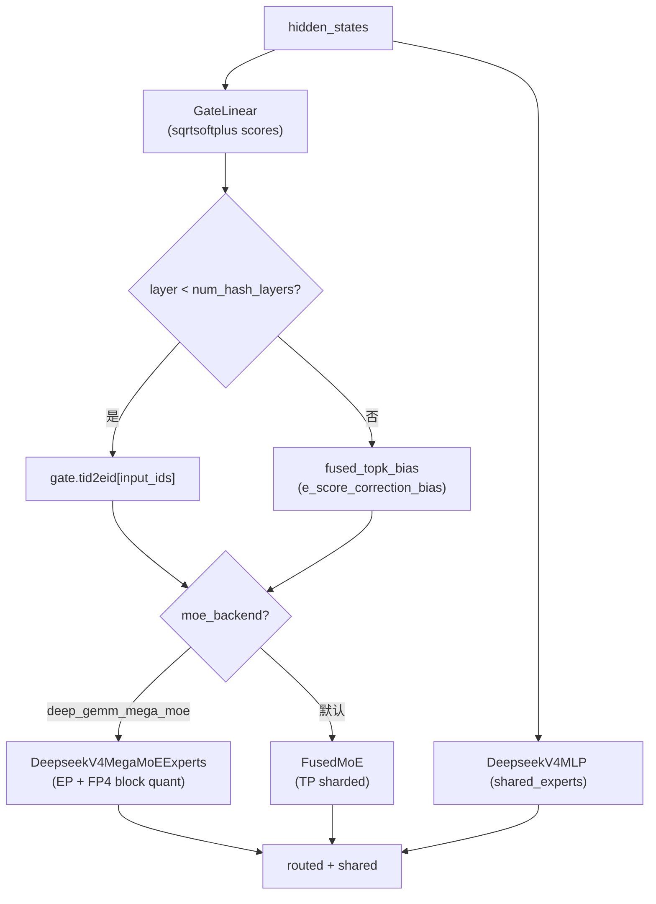

- **Hash MoE**：前 `num_hash_layers` 层，`tid2eid` 静态选 expert  
- **Top-K MoE**：`noaux_tc` + `e_score_correction_bias`  
- **MegaMoE**：需 `--enable-expert-parallel`，FP4 expert + EPLB  

---

### V6. MHC 与 MTP

| 组件 | 实现 | 说明 |
|------|------|------|
| Decoder mHC | `mhc_pre_tilelang` / `mhc_fused_post_pre_tilelang` | 层间可融合 post+pre |
| Model hc_head | `hc_head_fused_kernel_tilelang` | 输出前 HC 坍缩 |
| MTP | `DeepSeekV4MTP` | `e_proj`/`h_proj` + draft DecoderLayer + hc_head logits |

---

### V7. 模块依赖简图

```
DeepseekV4ForCausalLM (nvidia/amd/xpu)
├── DeepseekV4Model
│   ├── VocabParallelEmbedding
│   ├── topk_indices_buffer (Indexer 复用)
│   ├── DeepseekV4DecoderLayer[N]
│   │   ├── DeepseekV4Attention (平台子类)
│   │   │   ├── fused_wqa_wkv, wq_b, wo_a, wo_b
│   │   │   ├── DeepseekV4SWACache
│   │   │   ├── DeepseekCompressor (ratio>1)
│   │   │   └── DeepseekV4Indexer (ratio=4)
│   │   ├── DeepseekV4MoE
│   │   │   ├── GateLinear (+ tid2eid / bias)
│   │   │   ├── FusedMoE | MegaMoEExperts
│   │   │   └── DeepseekV4MLP (shared)
│   │   └── hc_attn_* / hc_ffn_* (TileLang MHC)
│   ├── hc_head_fn/base/scale
│   └── RMSNorm
├── ParallelLMHead
└── LogitsProcessor

DeepSeekV4MTP (投机 draft)
├── DeepSeekV4MultiTokenPredictorLayer
│   └── DeepseekV4DecoderLayer (draft)
└── e_proj / h_proj / SharedHead
```

---

### V8. 与其他实现映射

| vLLM | Transformers | InfiniLM C++ |
|------|--------------|--------------|
| `DeepseekV4Attention` | `DeepseekV4Attention` | `DeepseekV4Attention` |
| `DeepseekCompressor` | `HCA/CSA Compressor` | `DeepseekV4Compressor` |
| `DeepseekV4Indexer` | `DeepseekV4Indexer` | stub |
| TileLang MHC | `DeepseekV4HyperConnection` | `build_mhc_params` |
| `FusedMoE` / MegaMoE | `DeepseekV4Experts` | CPU-routed MoE |
| `DeepseekV4FlashMLABackend` | eager + Cache | `AttentionLayer`（未完整接入） |

---

## SGLang DeepSeek V4 模块梳理

来源：`deepseek_v4_sglang/deepseek_v4.py`（本仓库单文件入口）。  
大量子模块在 **SGLang 运行时包**内（`sglang.srt.*`），本文件负责组装与 forward 调度。

整体架构：**Fused MHC + RadixAttention/FlashMLA + DSV4 Compressor/Indexer + DeepseekV2MoE**。

---

### S1. 整体层级关系

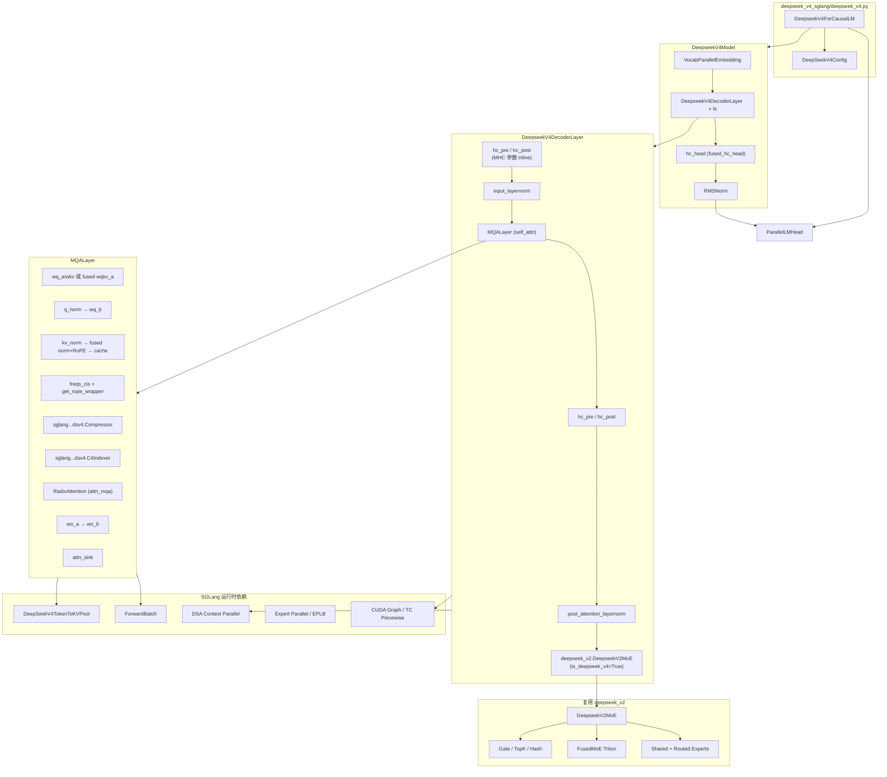

---

### S2. 本文件类 → 职责对照

| 类名（`deepseek_v4.py`） | 职责 | 外部依赖 |
|--------------------------|------|----------|
| `MQALayer` | MLA 注意力层 | `Compressor`, `C4Indexer`, `RadixAttention` |
| `DeepseekV4DecoderLayer` | 单层 Decoder | MHC + MQALayer + `DeepseekV2MoE` |
| `DeepseekV4Model` | 主干 | PP 分片、CP、MHC head |
| `DeepseekV4ForCausalLM` | Causal LM 入口 | logits、权重映射、EPLB |

**关键外部模块（不在本仓库，运行时由 SGLang 提供）：**

| 外部路径 | 职责 |
|----------|------|
| `sglang.srt.layers.attention.dsv4.compressor` | KV 压缩（C4/C128） |
| `sglang.srt.layers.attention.dsv4.indexer` | C4 Lightning Indexer |
| `sglang.srt.models.deepseek_v2` | `DeepseekV2MoE`, `ParallelLMHead` |
| `sglang.srt.mem_cache.memory_pool` | `RadixAttention`, KV pool |
| `sglang.jit_kernel.dsv4` | `fused_q_norm_rope`, `fused_norm_rope_inplace` |
| `sglang.srt.models.deepseek_common.amd.deepseek_v4_fused_mhc` | 融合 MHC post+pre |
| `sglang.srt.layers.moe.fused_moe_triton` | MoE Triton kernel |

---

### S3. 前向数据流

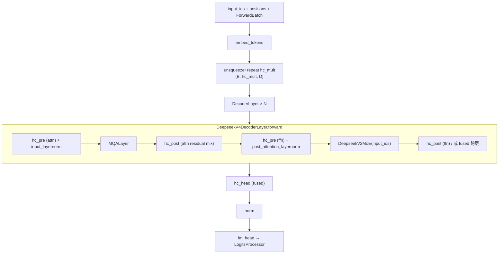

**MQALayer 内部（按 `compress_ratio`）：**

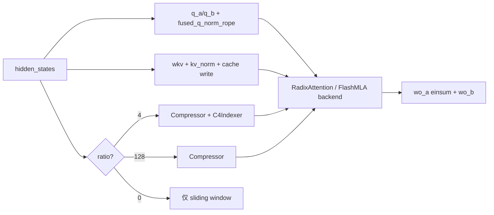

---

### S4. Attention 子模块（`MQALayer`）

| compress_ratio | Compressor | Indexer | KV Cache | 说明 |
|----------------|------------|---------|----------|------|
| 0 | 无 | 无 | `set_swa_key_buffer_radix_fused_norm_rope` | 纯 sliding MQA |
| 4 | `Compressor(ratio=4)` | `C4Indexer` | radix + 压缩块 | CSA + top-k |
| 128 | `Compressor(ratio=128)` | 无 | radix + 压缩块 | HCA 长程 |

融合优化：

- `fuse_wqa_wkv`：Q/KV 投影合并  
- `fused_q_norm_rope`：Q norm + RoPE 一体  
- multi-stream overlap：compressor / indexer 与主路径并行  

---

### S5. MoE 子模块（复用 V2）

SGLang **不单独实现 V4 MoE**，直接复用 `deepseek_v2.DeepseekV2MoE(is_deepseek_v4=True)`：

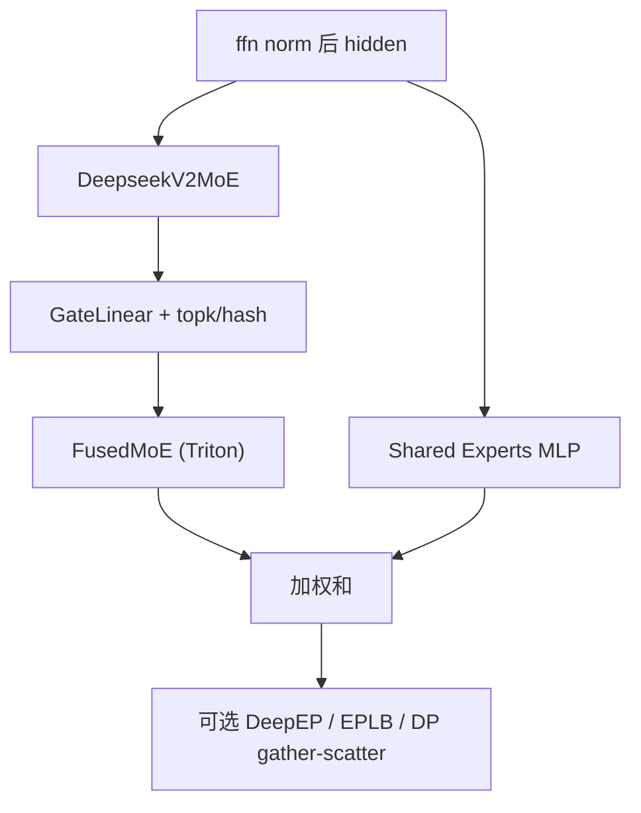

V4 特化：

- shared expert 与 routed expert **clamp 不同**，默认禁用 shared fusion  
- 权重名映射：`.gate.tid2eid` → `.topk.tid2eid`，`.w1/.w3` → gate/up proj  

---

### S6. MHC 与并行

| 机制 | 实现位置 | 说明 |
|------|----------|------|
| mHC pre/post | `DeepseekV4DecoderLayer.hc_pre/hc_post` | `hc_attn_*` / `hc_ffn_*` 参数 |
| 跨层融合 | `try_fused_hc_post_pre` (AMD) | attn hc_post + 下一层 ffn hc_pre 融合 |
| hc_head | `DeepseekV4Model.hc_head` → `fused_hc_head` | 输出前坍缩 |
| DSA CP | `dsa_cp_*`, `prepare_context_parallel_metadata` | Prefill 上下文并行 |
| PP | `PPMissingLayer`, `PPProxyTensors` | Pipeline 并行 |
| DP+MoE | `dp_gather_*`, `get_moe_a2a_backend` | Data parallel attention + MoE A2A |

---

### S7. 模块依赖简图

```
DeepseekV4ForCausalLM
├── DeepseekV4Model
│   ├── VocabParallelEmbedding
│   ├── alt_streams (multi-stream pool)
│   └── DeepseekV4DecoderLayer[N]
│       ├── MQALayer (self_attn)
│       │   ├── wq_a/wkv 或 wqkv_a, wq_b, kv_norm, q_norm
│       │   ├── Compressor (sglang dsv4)     [ratio=4/128]
│       │   ├── C4Indexer (sglang dsv4)      [ratio=4]
│       │   ├── RadixAttention (attn_mqa)
│       │   ├── freqs_cis / rotary_emb
│       │   └── wo_a, wo_b, attn_sink
│       ├── deepseek_v2.DeepseekV2MoE (mlp)
│       ├── input_layernorm, post_attention_layernorm
│       └── hc_attn_fn/base/scale, hc_ffn_fn/base/scale
│   ├── hc_head_fn/base/scale
│   └── RMSNorm
├── ParallelLMHead
└── LogitsProcessor

运行时
├── ForwardBatch + DeepSeekV4TokenToKVPool
├── FlashMLA / DSA attention backend
└── CUDA Graph (TC Piecewise / Breakable)
```

---

### S8. 三框架实现对比（推理栈）

| 维度 | Transformers | vLLM | SGLang |
|------|--------------|------|--------|
| 定位 | 参考 / 训练 | 高吞吐 serving | 高吞吐 serving |
| Attention | eager + Cache 类 | FlashMLA / FlashInfer sparse | RadixAttention + FlashMLA |
| Compressor | Python 模块 | Triton/CuteDSL + paged cache | `sglang dsv4.Compressor` |
| Indexer | Python 模块 | FP8/MXFP4 cache + fused q | `C4Indexer` |
| MoE | Python loop / hub kernel | FusedMoE / MegaMoE EP | DeepseekV2MoE + Triton |
| MHC | `HyperConnection` PyTorch | TileLang 融合 kernel | hc_pre/post + 可选 fused |
| 并行 | 单卡为主 | TP / PP / EP | TP / PP / DP / CP / EP |
| MTP | 无 | `DeepSeekV4MTP` | （见 SGLang 主仓库 NextN 支持） |