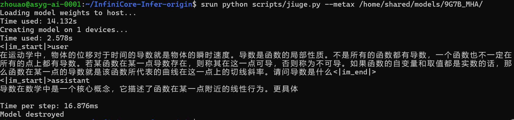
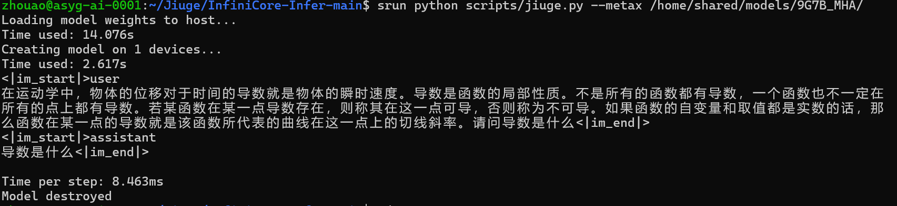
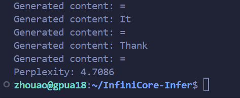

# 启元人工智能大赛 推理系统报告

## 1. 参与赛道
参与 **推理系统优化赛题**，基于 **InfiniCore-Infer 框架** 实现大模型推理引擎的性能优化。

## 2. 成果阐述
主要实现了两个部分的优化：服务层优化、基于稀疏注意力的推理加速

- 服务层优化：服务层主要针对内存管理、KV缓存池，以及批处理数量动态调整这三个方面进行了优化，在TTFT、请求速率、token生成速度等多方面取得较大的性能提升。

- 稀疏注意力：在推理阶段实现了 **动态 KV Cache 管理**，通过类似**最近窗口注意力**策略在Prefill阶段进行 **Key/Value 压缩存储**，减少显存占用，提升了解码速度。
  - **Prefill 阶段**：启用窗口裁剪（Pruning），利用了大模型注意力计算中对最近窗口的稀疏注意力关注模式，仅保留最近 `recentWindow` 长度的最近KV Cache存入KV Cache，剪裁掉了前面冗余的tokens。
  - **Decode 阶段**：基于裁剪后的 KV Cache 增量计算，避免全量计算，并将当前token新加入进KV Cache。进而大幅提高推理速度并降低了显存占用。
## 3. 技术亮点

### 一、内存管理优化

#### 1. 三层预分配架构设计

我们构建了一套基于内存块大小的智能分层预分配系统，核心思想是根据不同应用场景的内存使用模式，预先分配三个不同规模的内存池：

**分层策略设计：**
- **小块内存池（32MB）**：专门处理≤4KB的小对象，主要服务于元数据存储、临时变量、控制结构等高频小内存需求
- **中等内存池（64MB）**：负责4KB-64KB范围的中等内存分配，适用于中间计算结果、缓存数据、小型张量等
- **大块内存池（128MB）**：承载>64KB的大型数据结构，如模型权重、激活值、大型张量等核心计算数据

#### 2. 智能碎片整理

实现了基于多维度指标的预测性碎片检测算法：系统持续监控三个关键指标来判断是否需要进行碎片整理。首先是碎片率检测，通过计算空闲内存的分散程度来评估碎片化水平；其次是最大可用块检测，当最大连续空闲块小于总空闲内存的50%时，说明内存已经严重碎片化；最后是分配失败率检测，通过统计最近的分配失败次数来预测潜在的内存压力。

设计了新的碎片整理方法：整理过程按内存块类型分别进行，确保不同类型的内存块不会被错误合并。系统只处理相邻的空闲块，通过局部合并逐步改善内存布局，同时维护详细的统计信息用于性能分析和优化决策。

在模型推理过程中每进行10次推理就检查一次内存健康状况。这种周期性检查既保证了内存质量，又避免了过度频繁的整理操作影响性能。

### 二、KV缓存池

#### 1. KV缓存池架构设计

本架构包含可用缓存池用于管理空闲的KV缓存对象，缓存元数据字典记录每个缓存的详细信息和使用统计，前缀索引提供快速的缓存查找能力，LRU淘汰顺序维护缓存的使用时序，以及使用中缓存追踪确保正在使用的缓存不被误操作。

#### 2. 多层级前缀索引

系统为不同长度的token前缀建立独立的哈希索引，支持1、4、8、16、32、64等多个长度级别。每当有新的缓存加入时，系统会自动为其生成多个不同长度的前缀键，并将缓存索引添加到对应的索引表中。前缀键通过MD5哈希算法生成，确保快速查找的同时避免键冲突。不同长度的前缀索引服务于不同的匹配场景。短前缀（1-4 tokens）主要捕获对话开始模式和常见指令，适用于快速识别对话类型；中等前缀（8-16 tokens）用于识别对话上下文和主题，能够有效区分不同的对话场景；长前缀（32-64 tokens）则提供精确匹配能力，适用于复杂对话历史的完整匹配。

在搜索时，系统采用从长到短的前缀匹配策略，优先尝试64、32、16、8、4、1等不同长度的前缀。对于每个前缀长度，系统生成对应的前缀键并在索引表中查找匹配的缓存候选者。一旦找到足够数量（通常为5个）的候选者，就停止进一步搜索，避免不必要的计算开销。

通过这种分层索引设计，系统能够根据查询需求选择最适合的前缀长度，实现近似O(1)的查找复杂度。同时，多层级索引还提供了查找的灵活性，当长前缀匹配失败时，可以自动降级到短前缀匹配，确保总能找到最佳的可用缓存。

#### 3. LRU淘汰策略与性能监控：智能缓存生命周期管理

实现了基于使用频率和时间的智能LRU淘汰策略。当缓存池达到容量上限时，系统会自动识别最少使用的缓存进行淘汰。淘汰算法只针对当前未被使用的缓存，确保正在服务请求的缓存不会被误删除。系统维护了详细的使用时序记录，能够精确识别最适合淘汰的缓存对象。

系统为每个缓存维护详细的元数据，包括创建时间、最后访问时间、使用频率、匹配成功次数等。基于这些数据，系统计算每个缓存的综合价值分数，用于指导淘汰决策和匹配选择。高价值缓存会被优先保留，确保系统整体性能的最优化。

### 三、动态批处理数量优化

#### 1. 并发任务数估算

实现了基于GPU显存实时监控的智能并发任务数估算机制。通过精确计算单个KV缓存的显存占用量，结合当前GPU显存使用情况，动态确定系统最大并发处理能力。

具体来说，系统根据模型元数据（层数、KV头数、最大序列长度、头维度、数据类型）精确计算单个KV缓存的显存需求。计算公式考虑了每层的K和V两个缓存矩阵，形状为`[max_len, nkvh, dh]`，并根据数据类型（F16/F32/BF16）确定字节大小。最终得出单个KV缓存的总显存占用 = $ max\_len \times nkvh \times dh \times dtype\_size \times 2 \times nlayer \times ndev$，之后基于剩余显存和单个KV缓存占用，系统计算理论最大并发任务数 = $ available\_memory // single\_kvcache\_size$。同时考虑配置的最大批次限制，取两者最小值作为实际推荐的并发任务数，确保系统稳定运行。

#### 2. 自适应动态批处理管理

实现了基于显存压力和性能历史的自适应批处理管理系统，能够根据实时系统状态动态调整批处理策略。

系统将显存使用率划分为三个等级：低压力（<25%）、中等压力（25%-35%）、高压力（>60%）。不同压力等级对应不同的批处理策略和探索概率，确保在各种显存条件下都能获得最优性能。当显存占用超过80%时，使用当前最优批次大小；当显存占用较低时，使用最大批次大小。这种策略既保证了高显存压力下的系统稳定性，又充分利用了低压力时的处理能力。

系统维护持久化的批次性能数据，记录不同批次大小下的延迟和吞吐量表现。每个批次大小最多保留20个性能样本，避免数据过时影响决策准确性。基于历史性能数据，系统计算综合评分，包括效率评分、置信度奖励和批次大小奖励，根据评分结果动态调整批次大小。

### 四、稀疏注意力机制优化


系统采用 **最近窗口注意力（Sliding Window Attention）**，仅对最近 `recentWindow` 的 Token 建立全连接注意力；而较早的 Token 则通过 **压缩/裁剪策略**驱逐出KV Cache集合，从而避免了解码阶段的全量计算带来的显存和时间开销。
具体实现：
- **Prefill 阶段**：当输入序列长度 `seq_len > recentWindow` 时，仅保留区间 `[seq_len - recentWindow, seq_len]` 的 K/V 参与注意力计算，并将更早的部分进行截断或压缩后存入 KV Cache。
- **Decode 阶段**：增量解码时，新增 Token 仅与窗口内token交互，历史缓存不再全量重复计算。
- 可以通过jiuge.cpp的inferDeviceBatch中的稀疏注意力超参数**ratio**浮点数变量来改变稀疏比例（ratio表示所保留的KV Cache个数占不做裁剪的全量KV Cache的比例），以满足不同推理速度和生成精度需求。

## 4. 性能结果

<!-- 测试命令、性能数据、提升情况及截图 -->

使用框架中自带的测试脚本进行测试，测试命令为：

```bash
cd InfiniCore-Infer/
srun python scripts/launch_server.py --model-path /home/shared/models/9G7B_MHA --dev nvidia --ndev 1

srun python scripts/test_perf.py 
srun python scripts/test_server.py 
```

* **响应速度**：首次出词时间（TTFT）从平均3.32秒缩短至0.08秒，优化了97%，极大改善了用户的初始等待体验。
* **处理效率**：总耗时从22.11秒减少到19.28秒，节省了12.8%的时间。请求速率（RPS）从0.45提升至0.52，提高了15.6%。
* **Token生成速度**：平均每秒可生成52.91个token，相较于优化前的43.45个，提升了21.8%。

稀疏注意力加速效果：
采用128tokens的prompt 在metax GPU 压缩比为12.5%
- 加速前 (Time Per Second: 16.876ms)

- 加速后 (Time Per Second: 8.463ms)


优化后模型ppl为4.7086：



## 5. 时间线
