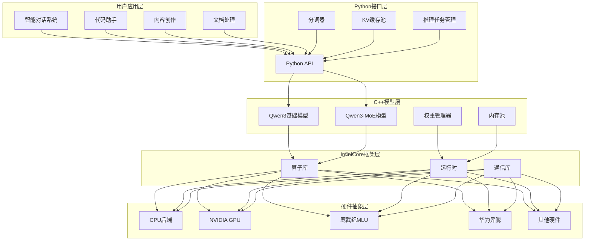
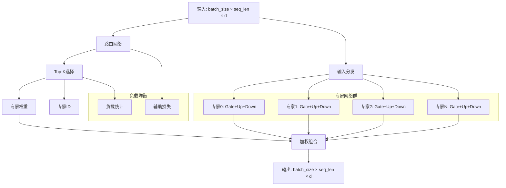
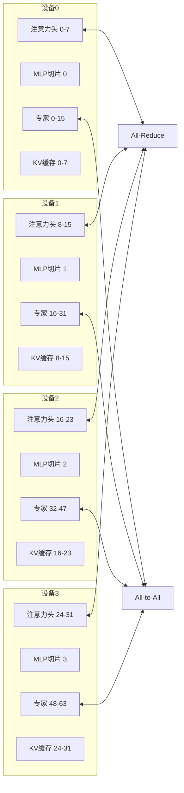

# 技术报告附录：架构图表和性能分析

## 附录A：系统架构图

### A.1 整体系统架构

```mermaid
graph TB
    subgraph "用户应用层"
        App1[智能对话系统]
        App2[代码助手]
        App3[内容创作]
        App4[文档处理]
    end
    
    subgraph "Python接口层"
        PyAPI[Python API]
        Tokenizer[分词器]
        KVPool[KV缓存池]
        InferTask[推理任务管理]
    end
    
    subgraph "C++模型层"
        Qwen3[Qwen3基础模型]
        Qwen3MoE[Qwen3-MoE模型]
        WeightMgr[权重管理器]
        MemPool[内存池]
    end
    
    subgraph "InfiniCore框架层"
        InfiniOp[算子库]
        InfiniRT[运行时]
        InfiniCCL[通信库]
    end
    
    subgraph "硬件抽象层"
        CPU[CPU后端]
        NVIDIA[NVIDIA GPU]
        Cambricon[寒武纪MLU]
        Ascend[华为昇腾]
        Other[其他硬件]
    end
    
    App1 --> PyAPI
    App2 --> PyAPI
    App3 --> PyAPI
    App4 --> PyAPI
    
    PyAPI --> Qwen3
    PyAPI --> Qwen3MoE
    Tokenizer --> PyAPI
    KVPool --> PyAPI
    InferTask --> PyAPI
    
    Qwen3 --> InfiniOp
    Qwen3MoE --> InfiniOp
    WeightMgr --> InfiniRT
    MemPool --> InfiniRT
    
    InfiniOp --> CPU
    InfiniOp --> NVIDIA
    InfiniOp --> Cambricon
    InfiniOp --> Ascend
    InfiniOp --> Other
    
    InfiniRT --> CPU
    InfiniRT --> NVIDIA
    InfiniRT --> Cambricon
    InfiniRT --> Ascend
    InfiniRT --> Other
    
    InfiniCCL --> CPU
    InfiniCCL --> NVIDIA
    InfiniCCL --> Cambricon
    InfiniCCL --> Ascend
    InfiniCCL --> Other
```

### A.2 MoE架构详细图

```mermaid
graph TD
    Input[输入: batch_size × seq_len × d] --> Router[路由网络]
    
    Router --> TopK[Top-K选择]
    TopK --> ExpertWeights[专家权重]
    TopK --> ExpertIDs[专家ID]
    
    Input --> Distribute[输入分发]
    
    subgraph "专家网络群"
        Expert0[专家0: Gate+Up+Down]
        Expert1[专家1: Gate+Up+Down]
        Expert2[专家2: Gate+Up+Down]
        ExpertN[专家N: Gate+Up+Down]
    end
    
    Distribute --> Expert0
    Distribute --> Expert1
    Distribute --> Expert2
    Distribute --> ExpertN
    
    Expert0 --> Combine[加权组合]
    Expert1 --> Combine
    Expert2 --> Combine
    ExpertN --> Combine
    
    ExpertWeights --> Combine
    
    Combine --> Output[输出: batch_size × seq_len × d]
    
    subgraph "负载均衡"
        AuxLoss[辅助损失]
        LoadStats[负载统计]
    end
    
    Router --> AuxLoss
    TopK --> LoadStats
```

### A.3 分布式推理架构

```mermaid
graph LR
    subgraph "设备0"
        D0_Attn[注意力头 0-7]
        D0_MLP[MLP切片 0]
        D0_Expert[专家 0-15]
        D0_KV[KV缓存 0-7]
    end
    
    subgraph "设备1"
        D1_Attn[注意力头 8-15]
        D1_MLP[MLP切片 1]
        D1_Expert[专家 16-31]
        D1_KV[KV缓存 8-15]
    end
    
    subgraph "设备2"
        D2_Attn[注意力头 16-23]
        D2_MLP[MLP切片 2]
        D2_Expert[专家 32-47]
        D2_KV[KV缓存 16-23]
    end
    
    subgraph "设备3"
        D3_Attn[注意力头 24-31]
        D3_MLP[MLP切片 3]
        D3_Expert[专家 48-63]
        D3_KV[KV缓存 24-31]
    end
    
    D0_Attn <--> AllReduce1[All-Reduce]
    D1_Attn <--> AllReduce1
    D2_Attn <--> AllReduce1
    D3_Attn <--> AllReduce1
    
    D0_Expert <--> AllToAll[All-to-All]
    D1_Expert <--> AllToAll
    D2_Expert <--> AllToAll
    D3_Expert <--> AllToAll
```
